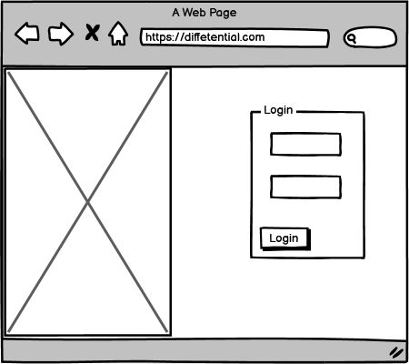
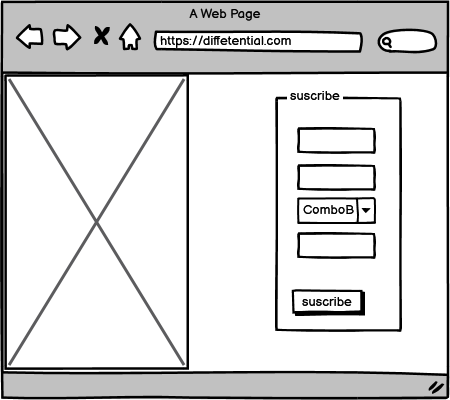
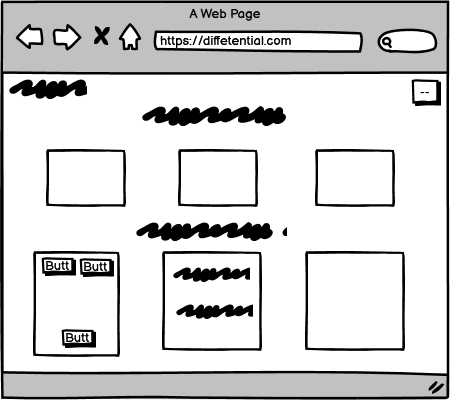
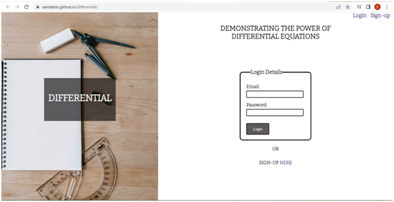
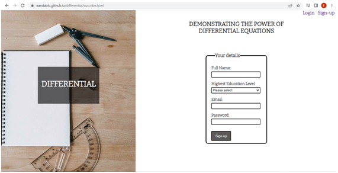
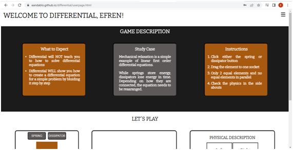
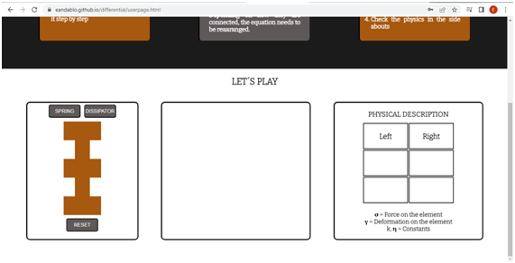
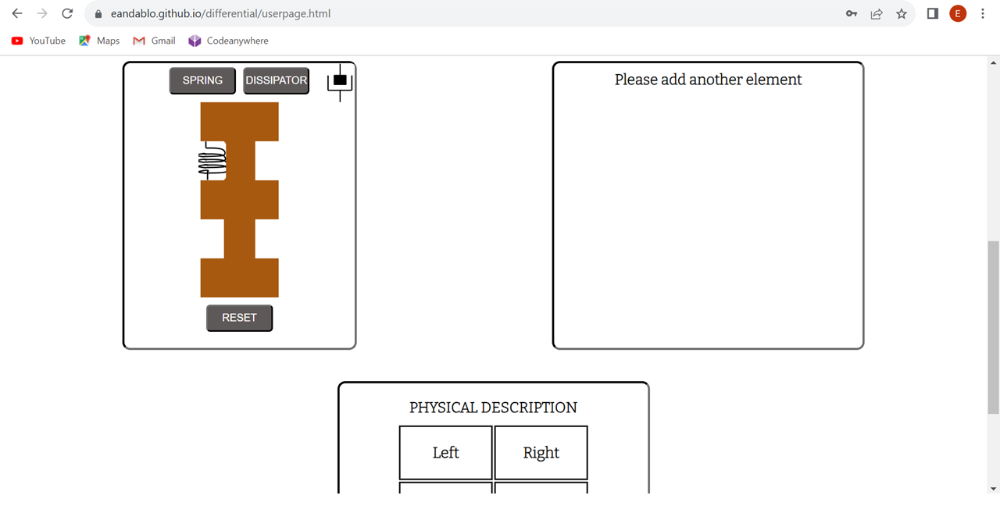
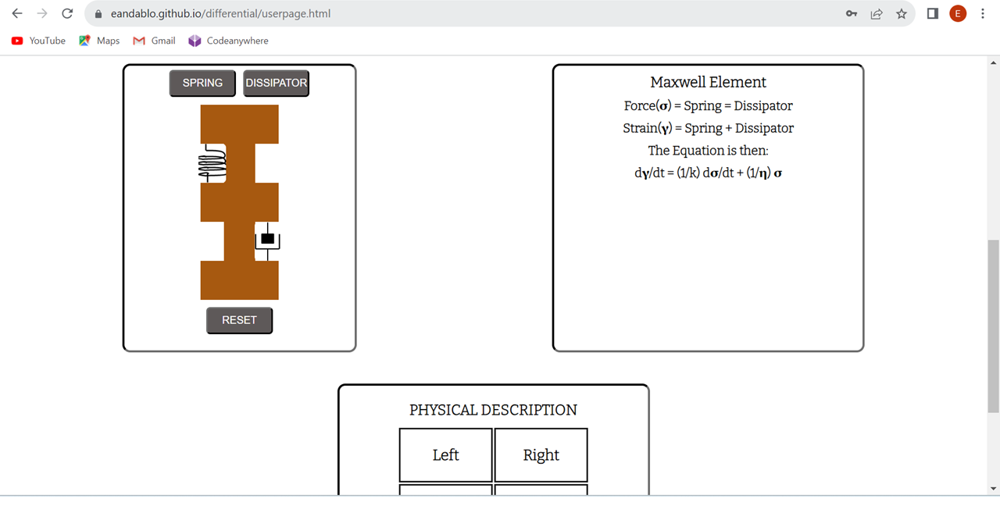

# Differential

[Please visit  the full live project here](https://eandablo.github.io/differential/)

Differential is a website designed to help people with basic knowledge of differencial calculus to understand the relevance of differential equations to mathematically represent physical problems. Differential guides the user to describe a simple problem, namely mechanical relaxation, in a single or set of differential equations. Later versions of the website are expected to include further challenges.

## User experience (UX)

### User stories

#### First time user

- As first time user, I need to find a friendly page to sign-up.
- As first time user, after signing up, I need to find a description of the website including instructions.
- As first time user, after using the game area I should feel incentivised to visit again.

#### Returning user

- As returning user, I need to find a friendly and simple login page.
- As returning user, After login in, I need to be able to access the information I used to sign-up.
- As returning user, I need to find instructions to use the page in order to refresh my past experience.
- As returning user, the game must increase my knwoledge on the subject.

### Design

#### Fonts

  The font Bitter was obtained from Google fonts and used althrough the website, with Georgia followed by Sans-Serif as websafe backup.

#### Color scheme

  The website is designed using a combination of four colors: i)white, used in background and font colour, ii)#1b1b1b, used in background and font colour, iii)#a75910, used in backgrounds and iv)#fa7d92, used in inputs background on focus. The correspondent contrast grid can be found [here](https://contrast-grid.eightshapes.com/?version=1.1.0&background-colors=&foreground-colors=%23FFFFFF%2C%20White%0D%0A%231b1b1b%0D%0A%23a75910%0D%0A%23fa7d92&es-color-form__tile-size=compact&es-color-form__show-contrast=aaa&es-color-form__show-contrast=aa&es-color-form__show-contrast=aa18&es-color-form__show-contrast=dnp).
  
### Wireframes

#### Login page

The login page has a simple design. At the left side a simple image to represent the subject, namely, math.
At the right top, there are two links, one for login and another for sign-up pages. Below, a simple fieldset
constains the inputs for login details.

#### Sign-up page

The sign-up page has the same structure as the login page. The only difference is that the fieldset contains four inputs.

#### User page

At the top of the user page a header contains a welcome message at the left and at the right a burger button
to diplay user information and log out option. Immediately below there is a section with description of the page. Below, the next section contains the game divided in three divs.

### Website surface

#### Login page

The login page greets the user with a suggestive picture of school utensiles at the left, to set the learning mood. At the top right to links takes us either to the login or sign-up pages. Bellow, approximatelly at the the vertical center, you will find the fieldset containing the inputs for email (username) and password, immediatelly followed by the login button. Just bellow the fieldset, there is another link to the sign-up page.

#### Sign-up page

The sign-up page has the same surface as the login page for consistency. The fieldset in this case contains four fields for user name, email, education level and password.

#### User page

After signing-up or login in, you will be redirected to the user page where the first thing tou will gind is a welcome message with your first name at the top left. At the top right you will find a burger button which at clicking on it will show you your info and a log out link.
The next section it the decription of the game. This contains three sections: Description, the case of study and the instructions.

The last section contains the game. The left about contains the actual playground with a docking area to latch elements you can produce by clicking on the top buttons. In the desktop version you can drag the elements to the sockets and the element will latch at proximity to the point. To reset the game simple click the reset button at the bottom. The center and left about contains the updated equation and physics descriing the right about  respectively.

Elements are created by clicking either the spring or dissipator buttons. Once one element has been created, it can be dragged to one of the four sockets as shown in the figure below.

Once 2 or more elements are latch, the equations are shwon end explained as shown in the picture below.

## Features

- Responsive to most devices, but differential is not appropriate for use in Galaxy fold device due to the narrow screen and incompatibility with the game area.
  - [index](http://www.responsinator.com/?url=https%3A%2F%2Feandablo.github.io%2Fdifferential%2F)
  - [suscribe](http://www.responsinator.com/?url=https%3A%2F%2Feandablo.github.io%2Fdifferential%2Fsuscribe.html)
  - [userpage](http://www.responsinator.com/?url=https%3A%2F%2Feandablo.github.io%2Fdifferential%2Fuserpage.html)
- Interactive elements: draggable elements, buttons, text inputs.

## Technologies Used

### Languages Used

- HTML5
- CSS3
- Javascrypt

### Frameworks, Libraries & Programs Used

1. [Google Fonts:](https://fonts.google.com/) Bitter font was imported to CSS stylesheet from Google fonts.
2. [GitHub:](https://github.com/) GitHub is used to store the projects code after being pushed from Codeanywhere.
3. [Balsamiq:](https://balsamiq.com/) Balsamiq was used to create the wireframes.
4. [Codeanywhere:](https://app.codeanywhere.com/) Codeanywhere was used to create website content.
5. Microsoft Paint was used to create spring and dissipator images.

## Testing

The W3C Markup Validator and W3C CSS Validator Services were used to validate every page of the project to ensure there were no syntax errors in the project.

- [W3C HTML Validator](https://validator.w3.org/nu/)
  - [index results](https://eandablo.github.io/differential/)
  - [suscribe results](https://validator.w3.org/nu/?doc=https%3A%2F%2Feandablo.github.io%2Fdifferential%2Fsuscribe.html)
  - [userpage results](https://validator.w3.org/nu/?doc=https%3A%2F%2Feandablo.github.io%2Fdifferential%2Fuserpage.html)
- [W3C CSS Validator](https://jigsaw.w3.org/css-validator/) - [Results](https://jigsaw.w3.org/css-validator/validator?uri=https%3A%2F%2Feandablo.github.io%2Fdifferential%2F&profile=css3svg&usermedium=all&warning=1&vextwarning=&lang=en)
- JS code was debugged using JShints with no errors or serious warnings found.

### Testing User Stories from User Experience (UX) Section

#### First time user

1. As first time user, I need to find a friendly page to sign-up.
   - I found a login page and I am greeted by an image that reminded me of school and links to the sign-up page.
   - The sign-up page is consistent in appearance with the login page and informationn is easily filled.After clicking on submit, I am transfered to the userpage where I am greeted wit a welcome message.
   - Unfortunately, the site is not able to store my information at the moment.

2. As first time user, after signing up, I need to find a description of the website including instructions.

   - On the user page, I find clear messages of what to expect of the website and instructions to play the game.

3. As first time user, after using the game area I should feel incentivised to visit again.
  
   - The game is easy to play and the information received is not easy to process at first, but it is clear.
   - To log out after clicking the burger button I found together with my user information a link to log out.

#### Returning user

1. As returning user, I need to find a friendly and simple login page.
   - Asssuming my login information is stored in the site, I easily login by entering my email and password.
2. As returning user, after login in, I need to be able to access the information I used to sign-up.
   - I revised my information by clicking on the burger button.
3. As returning user, I need to find instructions to use the page in order to refresh my past experience.
   - I read again the instructions of the game.
4. As returning user, the game must increase my knwoledge on the subject.
   - After playing a second time I started to understand better the physics and how to create differential equation to mathematically express it.

### Known bugs

No bugs were found after testing in several devices.

## Future improvements

In the current state, the sign-up page is not capable to store the information user for login later. This will be fixed in future versions.

## Deployment

### GitHub Pages

The project was deployed to GitHub Pages using the following steps:

1. Log in to GitHub and locate the [Differential GitHub Repository](https://github.com/eandablo/differential).
2. At the top of the Repository, locate the "Settings" Button on the menu.
3. Scroll down the Settings page until you locate the "GitHub Pages" Section.
4. Under "Source", click the dropdown called "None" and select "Master Branch".
5. The page will automatically refresh.
6. Scroll back down through the page to locate the now published site [link](https://github.com/eandablo/differential) in the "GitHub Pages" section.

### Forking the GitHub Repository

By forking the GitHub Repository we make a copy of the original repository on our GitHub account to view and/or make changes without affecting the original repository by using the following steps...

1. Log in to GitHub and locate the [GitHub Repository](https://github.com/eandablo/differential)
2. At the top of the Repository (not top of page) just above the "Settings" Button on the menu, locate the "Fork" Button.
3. You should now have a copy of the original repository in your GitHub account.

### Making a Local Clone

1. Log in to GitHub and locate the [GitHub Repository](https://github.com/eandablo/differential)
2. Under the repository name, click "Clone or download".
3. To clone the repository using HTTPS, under "Clone with HTTPS", copy the link.
4. Open Git Bash
5. Change the current working directory to the location where you want the cloned directory to be made.
6. Type `git clone`, and then paste the URL you copied in Step 3.

## Credits

### Code

Import statement in stylesheets for primary fonts was obtained from [Google fonts](https://fonts.google.com/).

### Content

- Differetial website content was created by Efren A Andablo Reyes.
- Deployment steps cited in this readme file were obtained from the Code Institute website [readme file](https://github.com/Code-Institute-Solutions/SampleREADME/blob/master/README.md?plain=1).

### Imagery

- Images for dissipator and spring elements were created by the author. Other images were obtained from [pexels.com](https://pexels.com).

### Acknowledgement

- Special acknowkedge to my mentor Dario Carrasquel for his guidence.
  